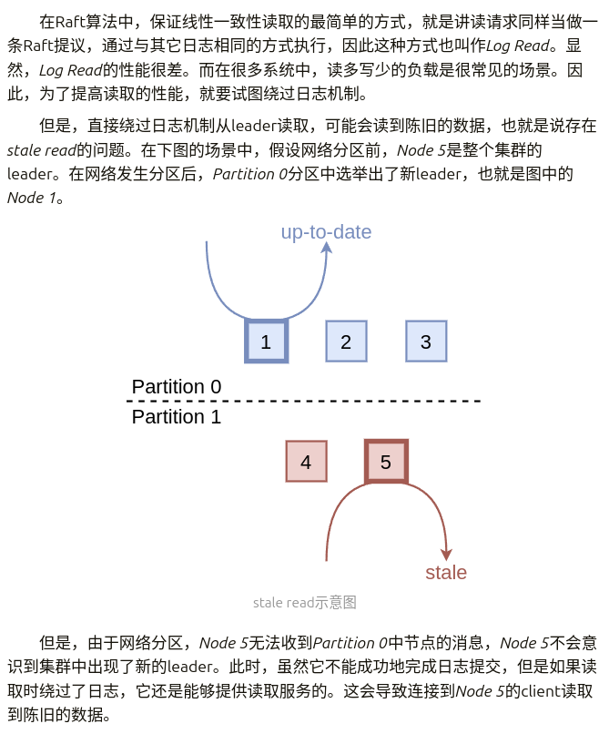
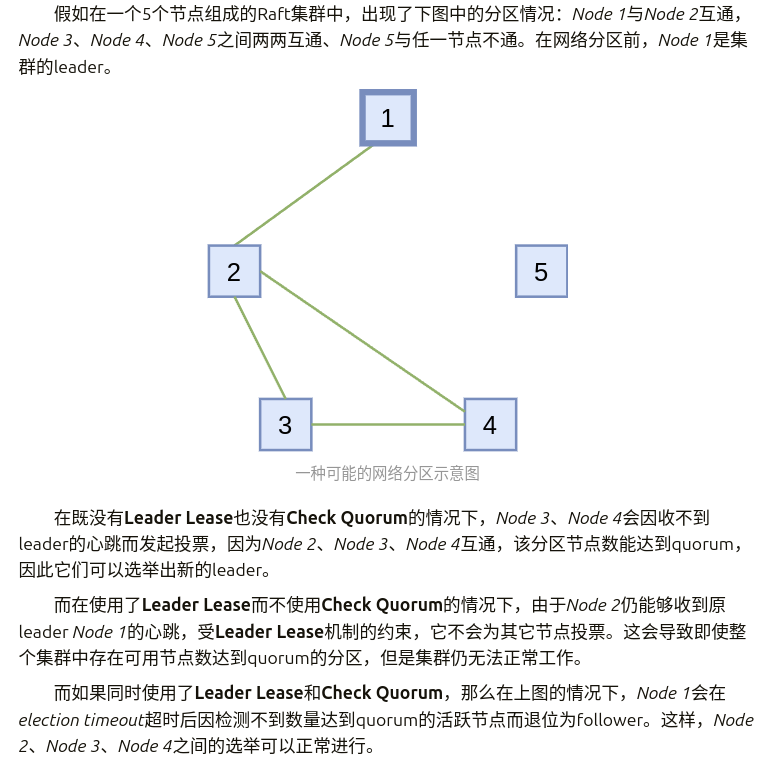
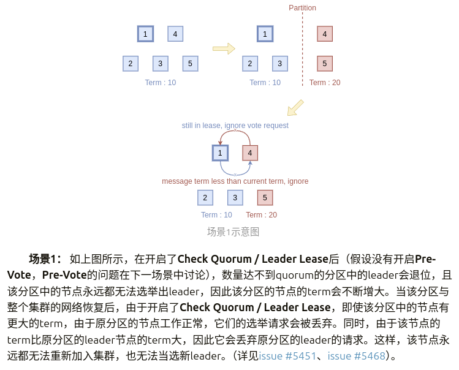
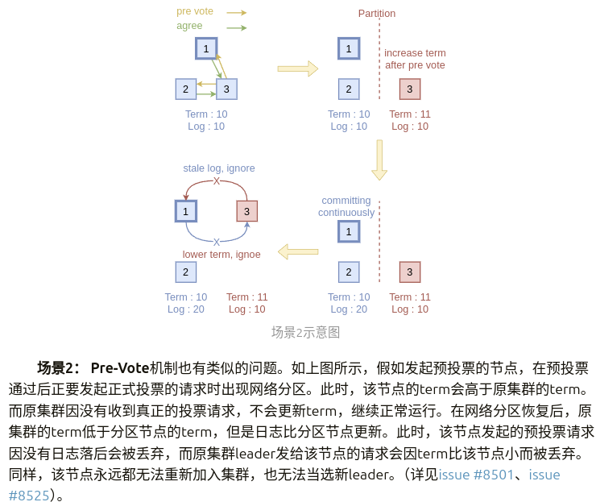

# 1. 选举的优化
## 1.1 pre-vote
当网络出现分区的时候，不满足quorum的区域是会无限增大任期，同时发起选举的。这导致的问题就是当网络恢复分区之后会出现一次log远远落后的选举，我们认为这次选举显然是没有必要的。
所以引入一个机制，follower -> candidate之前需要发起一次pre-vote请求，确认自己可以收到quorum的投票才开始请求投票。

## 1.2 Check Quorum
这个机制我在自己的写的raft业实现了。这个机制的主要工作原理是leader每隔一段时间主动检查follower是否活跃，如果活跃数达不到quorum则主动转为follower。

其产生的原因:



## 1.3 Leader Lease
这个机制主要是为了解决leader影响范围内的节点，不应该向其他发起选举的节点投票，这可以保证正常工作的集群不发生无效选举。

`Leader Lease`机制需要`Check Quorum`机制的协助才能正常工作，有这样一个例子。



## 1.4 引入的新问题



**场景3：** 在更复杂的情况中，比如，在变更配置时，开启了原本没有开启的**Pre-Vote**机制。此时可能会出现与上一条类似的情况，即可能因term更高但是log更旧的节点的存在导致整个集群的死锁，所有节点都无法预投票成功。这种情况比上一种情况更危险，上一种情况只有之前分区的节点无法加入集群，在这种情况下，整个集群都会不可用。（详见[issue #8501](https://github.com/etcd-io/etcd/issues/8501)、[issue #8525](https://github.com/etcd-io/etcd/pull/8525)）。

为了解决以上问题，节点在收到term比自己低的请求时，需要做特殊的处理。处理逻辑也很简单：

1. 如果收到了term比当前节点term低的leader的消息，且集群开启了**Check Quorum / Leader Lease**或**Pre-Vote**，那么发送一条term为当前term的消息，令term低的节点成为follower。（针对**场景1**、**场景2**）
2. 对于term比当前节点term低的预投票请求，无论是否开启了**Check Quorum / Leader Lease**或**Pre-Vote**，都要通过一条term为当前term的消息，迫使其转为follower并更新term。（针对**场景3**）


# 选举实现
## 2.1 选举开始前
MsgHub是应用层通知raft层开始选举的消息，应用层通过调用node的Campaign方法，然后调用Step方法交给rafe层处理。
```go
// node的一个样例实现
// *** rawnode.go *** 
func (rn *RawNode) Campaign() error {
	return rn.raft.Step(pb.Message{
		Type: pb.MsgHup,
	})
}
```

Step方法主要负责处理raft状态机的变化。其下面这段逻辑负责选举。
```go
func (r *raft) Step(m pb.Message) error {
	// .......
	switch m.Type {  
	case pb.MsgHup:  
	    if r.preVote {  
	       r.hup(campaignPreElection)  
	    } else {  
	       r.hup(campaignElection)  
	    }
	// .......
}
```
上面的逻辑会根据是否开启pre-vote机制来决定选举逻辑，hup方法的参数主要是下面前两个常量。
```go
const (  
    // 开启pre-vote
    campaignPreElection CampaignType = "CampaignPreElection"  
	// 正常选举
	campaignElection CampaignType = "CampaignElection"  
    // leader 迁移
	campaignTransfer CampaignType = "CampaignTransfer"  
)
```

接下来我们就可以进入hup方法了。
```go
func (r *raft) hup(t CampaignType) {
	if r.state == StateLeader {
		r.logger.Debugf("%x ignoring MsgHup because already leader", r.id)
		return
	}

	if !r.promotable() {
		r.logger.Warningf("%x is unpromotable and can not campaign", r.id)
		return
	}
	ents, err := r.raftLog.slice(r.raftLog.applied+1, r.raftLog.committed+1, noLimit)
	if err != nil {
		r.logger.Panicf("unexpected error getting unapplied entries (%v)", err)
	}
	if n := numOfPendingConf(ents); n != 0 && r.raftLog.committed > r.raftLog.applied {
		r.logger.Warningf("%x cannot campaign at term %d since there are still %d pending configuration changes to apply", r.id, r.Term, n)
		return
	}

	r.logger.Infof("%x is starting a new election at term %d", r.id, r.Term)
	r.campaign(t)
}
```
hup方法主要是对选举前的状态进行一些检查。首先是看当前节点是否是leader，接着就是promotable方法判断当前节点能否提升为leader，最后就是看是否有配置变更。
接着我们来分析一下promotable方法。
```go
// promotable indicates whether state machine can be promoted to leader,
// which is true when its own id is in progress list.
func (r *raft) promotable() bool {
	pr := r.prs.Progress[r.id]
	return pr != nil && !pr.IsLearner && !r.raftLog.hasPendingSnapshot()
}
```
三条判断规则分别代表。
1. 当前节点是否已被集群移除。
2. 当前节点是否为learner节点。
3. 当前节点是否还有未被保存到稳定存储中的快照。

## 2.2开始选举
一些前置的判断完成后我们就可以进入campaign开始正式的选举。
```go
func (r *raft) campaign(t CampaignType) {  
    if !r.promotable() {  
       // This path should not be hit (callers are supposed to check), but  
       // better safe than sorry.       r.logger.Warningf("%x is unpromotable; campaign() should have been called", r.id)  
       r.logger.Warningf("%x is unpromotable; campaign() should have been called", r.id)
    }  
    var term uint64  
    var voteMsg pb.MessageType  
    if t == campaignPreElection {  
       r.becomePreCandidate()  
       voteMsg = pb.MsgPreVote  
       // PreVote RPCs are sent for the next term before we've incremented r.Term.  
       term = r.Term + 1  
    } else {  
       r.becomeCandidate()  
       voteMsg = pb.MsgVote  
       term = r.Term  
    }  
    if _, _, res := r.poll(r.id, voteRespMsgType(voteMsg), true); res == quorum.VoteWon {  
       // We won the election after voting for ourselves (which must mean that  
       // this is a single-node cluster). Advance to the next state.       if t == campaignPreElection {  
          r.campaign(campaignElection)  
       } else {  
          r.becomeLeader()  
       }  
       return  
    }  
    var ids []uint64  
    {  
       idMap := r.prs.Voters.IDs()  
       ids = make([]uint64, 0, len(idMap))  
       for id := range idMap {  
          ids = append(ids, id)  
       }  
       sort.Slice(ids, func(i, j int) bool { return ids[i] < ids[j] })  
    }  
    for _, id := range ids {  
       if id == r.id {  
          continue  
       }  
       r.logger.Infof("%x [logterm: %d, index: %d] sent %s request to %x at term %d",  
          r.id, r.raftLog.lastTerm(), r.raftLog.lastIndex(), voteMsg, id, r.Term)  
  
       var ctx []byte  
       if t == campaignTransfer {  
          ctx = []byte(t)  
       }  
       r.send(pb.Message{Term: term, To: id, Type: voteMsg, Index: r.raftLog.lastIndex(), LogTerm: r.raftLog.lastTerm(), Context: ctx})  
    }  
}
```
因为调用campaign只有Step方法，所以还是得先判断一下是否还具有变成leader的能力。接着就开始判断是pre-vote还是vote，term是给后面发消息做准备。接着调用poll方法给自己投票，如果是单节点启动，现在就可以开始投票(之前是预投票)或者become leader。最后就是最常见的情况，就是开始发起投票，首先获取所有的节点id，然后向所有节点发起投票请求。

## 2.3其他节点对投票请求的处理
### 2.3.1 先对Step方法进行一个分析。
首先还是需要从Step方法进入。我们可以在这里对Step方法进行一下全面的分析。

首先是对于Term为0的本地消息不进行处理，直接进行后续的逻辑。
接着如果term大于当前节点的term，则是有可能变成follower，所以需要先去掉特使情况，首先判断是否是leader 迁移或者是否在租约内，如果`!force && inLease`则不进行处理，接着进入一个switch
1. 如果是pre-vote，忽略（还记得之前发起pre-vote会term+1吗？）
2. 若是是`MsgPreVoteResp`且`Reject`字段不为真时，那么不需要转为follower。
3. 接下来就进入转follower环节。
然后进入了Term小于当前term的分支，首先是对前面优化的出现问题的情况1和情况2进行处理，接着是对情况3进行处理。其他情况则直接忽略。

接着进入m.Type的判断，首先是MsgHup，这个我们前面已经说过，接着就是MsgVote和MsgPreVote。首先是对是否可以投票进行校验。
	1.我的票已经投给你
	2.票未投出且无leader
	3. 预投票请求则需要term大于当前term
满足以上条件同是log比当前节点的新，则可以投票给他。如果MsgVote则，则需要更新一下投票和electionElapsed。否则投出拒绝票。剩余我们就交给raft的`step`方法了。
```go
func (r *raft) Step(m pb.Message) error {  
    switch {  
    case m.Term == 0:  
    case m.Term > r.Term:  
       if m.Type == pb.MsgVote || m.Type == pb.MsgPreVote {  
          force := bytes.Equal(m.Context, []byte(campaignTransfer))  
          inLease := r.checkQuorum && r.lead != None && r.electionElapsed < r.electionTimeout  
          if !force && inLease {  
                r.id, r.raftLog.lastTerm(), r.raftLog.lastIndex(), r.Vote, m.Type, m.From, m.LogTerm, m.Index, r.Term, r.electionTimeout-r.electionElapsed)  
             return nil  
          }  
       }  
       switch {  
       case m.Type == pb.MsgPreVote:   
       case m.Type == pb.MsgPreVoteResp && !m.Reject:  
       default:
          r.logger.Infof("%x [term: %d] received a %s message with higher term from %x [term: %d]",  
             r.id, r.Term, m.Type, m.From, m.Term)  
          if m.Type == pb.MsgApp || m.Type == pb.MsgHeartbeat || m.Type == pb.MsgSnap {  
             r.becomeFollower(m.Term, m.From)  
          } else {  
             r.becomeFollower(m.Term, None)  
          }  
       }  
  
    case m.Term < r.Term:  
       if (r.checkQuorum || r.preVote) && (m.Type == pb.MsgHeartbeat || m.Type == pb.MsgApp) {  
	       r.send(pb.Message{To: m.From, Type: pb.MsgAppResp})
       } else if m.Type == pb.MsgPreVote {  
          r.logger.Infof("%x [logterm: %d, index: %d, vote: %x] rejected %s from %x [logterm: %d, index: %d] at term %d",  
             r.id, r.raftLog.lastTerm(), r.raftLog.lastIndex(), r.Vote, m.Type, m.From, m.LogTerm, m.Index, r.Term)  
          r.send(pb.Message{To: m.From, Term: r.Term, Type: pb.MsgPreVoteResp, Reject: true})  
       } else {  
          // ignore other cases  
          r.logger.Infof("%x [term: %d] ignored a %s message with lower term from %x [term: %d]",  
             r.id, r.Term, m.Type, m.From, m.Term)  
       }  
       return nil  
    }  
  
    switch m.Type {  
    case pb.MsgHup:  
       if r.preVote {  
          r.hup(campaignPreElection)  
       } else {  
          r.hup(campaignElection)  
       }  
  
    case pb.MsgVote, pb.MsgPreVote:  
       canVote := r.Vote == m.From ||  
          (r.Vote == None && r.lead == None) ||  
          (m.Type == pb.MsgPreVote && m.Term > r.Term)  
	    if canVote && r.raftLog.isUpToDate(m.Index, m.LogTerm) {  
			r.logger.Infof("%x [logterm: %d, index: %d, vote: %x] cast %s for %x [logterm: %d, index: %d] at term %d",  
			    r.id, r.raftLog.lastTerm(), r.raftLog.lastIndex(), r.Vote, m.Type, m.From, m.LogTerm, m.Index, r.Term)
		    r.send(pb.Message{To: m.From, Term: m.Term, Type: voteRespMsgType(m.Type)})
			if m.Type == pb.MsgVote {  
	            r.electionElapsed = 0  
	            r.Vote = m.From  
	        }  
       } else {  
			r.logger.Infof("%x [logterm: %d, index: %d, vote: %x] rejected %s from %x [logterm: %d, index: %d] at term %d",  
				 r.id, r.raftLog.lastTerm(), r.raftLog.lastIndex(), r.Vote, m.Type, m.From, m.LogTerm, m.Index, r.Term)  
			r.send(pb.Message{To: m.From, Term: r.Term, Type: voteRespMsgType(m.Type), Reject: true})  
       }  
  
    default:  
       err := r.step(r, m)  
       if err != nil {  
          return err  
       }  
    }  
    return nil  
}
```

### 2.3.2 stepXXX和becomexxx
因为不同状态对消息的处理事不同的，所以需要考虑在状态变更的同时变更step方法。对应关系如下。

| becomexxx          | stepXXX       |
| ------------------ | ------------- |
| becomeCandidate    | stepCandidate |
| becomePreCandidate | stepCandidate |
| becomeLeader       | stepLeader    |
| becomeFollower     | stepFollower  |
#### 2.3.2.1  candidate and PreCandidate
我们可以先从candidate开始。
```go
func (r *raft) becomeCandidate() {  
    if r.state == StateLeader {  
       panic("invalid transition [leader -> candidate]")  
    }  
    r.step = stepCandidate  
    r.reset(r.Term + 1)  
    r.tick = r.tickElection  
    r.Vote = r.id  
    r.state = StateCandidate  
    r.logger.Infof("%x became candidate at term %d", r.id, r.Term)  
}  
  
func (r *raft) becomePreCandidate() {  
    if r.state == StateLeader {  
       panic("invalid transition [leader -> pre-candidate]")  
    }  
    r.step = stepCandidate  
    r.prs.ResetVotes()  
    r.tick = r.tickElection  
    r.lead = None  
    r.state = StatePreCandidate  
    r.logger.Infof("%x became pre-candidate at term %d", r.id, r.Term)  
}
```
对于step和tick,  二者可以在状态发生改变时变化。tick是node结构体通过Tick方法触发的。
```go
tick func()  
step stepFunc

type stepFunc func(r *raft, m pb.Message) error
```

上面的逻辑比较简单，这里不做过多讲述。我们可以看看stepCandidate方法。
```go
func stepCandidate(r *raft, m pb.Message) error {  
    var myVoteRespType pb.MessageType  
    if r.state == StatePreCandidate {  
       myVoteRespType = pb.MsgPreVoteResp  
    } else {  
       myVoteRespType = pb.MsgVoteResp  
    }  
    switch m.Type {  
    case pb.MsgProp:  
       r.logger.Infof("%x no leader at term %d; dropping proposal", r.id, r.Term)  
       return ErrProposalDropped  
    case pb.MsgApp:  
       r.becomeFollower(m.Term, m.From) // always m.Term == r.Term  
       r.handleAppendEntries(m)  
    case pb.MsgHeartbeat:  
       r.becomeFollower(m.Term, m.From) // always m.Term == r.Term  
       r.handleHeartbeat(m)  
    case pb.MsgSnap:  
       r.becomeFollower(m.Term, m.From) // always m.Term == r.Term  
       r.handleSnapshot(m)  
    case myVoteRespType:  
       gr, rj, res := r.poll(m.From, m.Type, !m.Reject)  
       r.logger.Infof("%x has received %d %s votes and %d vote rejections", r.id, gr, m.Type, rj)  
       switch res {  
       case quorum.VoteWon:  
          if r.state == StatePreCandidate {  
             r.campaign(campaignElection)  
          } else {  
             r.becomeLeader()  
             r.bcastAppend()  
          }  
       case quorum.VoteLost:  
          // pb.MsgPreVoteResp contains future term of pre-candidate  
          // m.Term > r.Term; reuse r.Term          
          r.becomeFollower(r.Term, None)  
       }  
    case pb.MsgTimeoutNow:  
       r.logger.Debugf("%x [term %d state %v] ignored MsgTimeoutNow from %x", r.id, r.Term, r.state, m.From)  
    }  
    return nil  
}
```
首先分析stepCandidate方法。先对myVoteRespType进行一个判断赋值，接着对接收到消息类型进行判断，
1. 如果是MsgProp无法处理直接返回，
2. 三种leader进行对于的处理。
3. 最后是投票的处理，首先是调用poll方法来获取投票结果，如果获取了大多数的票数则可以开始投票或者becomeLeader，否则becomeFollower。
4. 最后就是MsgTimeoutNow，这个是旧leader向新leader发送该消息通知可以进行迁移了，candidate可以忽略。
reset方法我们放到后面的日志复制讲，因为还带有一些日志复制的逻辑。
tickElection方法主要是node结构体的Tick方法调用。该方法主要是增大electionElapsed，然后判断是否可以进入follower -> candidate流程。
```go
func (r *raft) tickElection() {  
    r.electionElapsed++  
  
    if r.promotable() && r.pastElectionTimeout() {  
       r.electionElapsed = 0  
       r.Step(pb.Message{From: r.id, Type: pb.MsgHup})  
    }  
}
```

#### 2.3.2.2  Leader
```go
func (r *raft) becomeLeader() {  
    if r.state == StateFollower {  
       panic("invalid transition [follower -> leader]")  
    }  
    r.step = stepLeader  
    r.reset(r.Term)  
    r.tick = r.tickHeartbeat  
    r.lead = r.id  
    r.state = StateLeader  
	//......
}
```
这个逻辑有部分log相关逻辑，暂时隐去，以上逻辑较为简单，不做过多赘述。

我们继续来看看stepLeader方法选举相关的逻辑。
```go
func stepLeader(r *raft, m pb.Message) error {
	switch m.Type {
	case pb.MsgBeat:
		r.bcastHeartbeat()
		return nil
	case pb.MsgCheckQuorum:
		if pr := r.prs.Progress[r.id]; pr != nil {
			pr.RecentActive = true
		}
		if !r.prs.QuorumActive() {
			r.logger.Warningf("%x stepped down to follower since quorum is not active", r.id)
			r.becomeFollower(r.Term, None)
		}
		// Mark everyone (but ourselves) as inactive in preparation for the next
		// CheckQuorum.
		r.prs.Visit(func(id uint64, pr *tracker.Progress) {
			if id != r.id {
				pr.RecentActive = false
			}
		})
		return nil
	// ... ...
	}
	
	pr := r.prs.Progress[m.From]
	if pr == nil {
		r.logger.Debugf("%x no progress available for %x", r.id, m.From)
		return nil
	}
	switch m.Type {
	// ... ...
	case pb.MsgTransferLeader:
		if pr.IsLearner {
			r.logger.Debugf("%x is learner. Ignored transferring leadership", r.id)
			return nil
		}
		leadTransferee := m.From
		lastLeadTransferee := r.leadTransferee
		if lastLeadTransferee != None {
			if lastLeadTransferee == leadTransferee {
				r.logger.Infof("%x [term %d] transfer leadership to %x is in progress, ignores request to same node %x",
					r.id, r.Term, leadTransferee, leadTransferee)
				return nil
			}
			r.abortLeaderTransfer()
			r.logger.Infof("%x [term %d] abort previous transferring leadership to %x", r.id, r.Term, lastLeadTransferee)
		}
		if leadTransferee == r.id {
			r.logger.Debugf("%x is already leader. Ignored transferring leadership to self", r.id)
			return nil
		}
		// Transfer leadership to third party.
		r.logger.Infof("%x [term %d] starts to transfer leadership to %x", r.id, r.Term, leadTransferee)
		// Transfer leadership should be finished in one electionTimeout, so reset r.electionElapsed.
		r.electionElapsed = 0
		r.leadTransferee = leadTransferee
		if pr.Match == r.raftLog.lastIndex() {
			r.sendTimeoutNow(leadTransferee)
			r.logger.Infof("%x sends MsgTimeoutNow to %x immediately as %x already has up-to-date log", r.id, leadTransferee, leadTransferee)
		} else {
			r.sendAppend(leadTransferee)
		}
	}
	return nil
}
```
stepLeader主要处理两类消息，一类是本地消息，另外一类就是来自其他节点的。
首先是本地消息。
1. 收到MsgBeat则发送心跳给其他节点。
2. MsgCheckQuorum收到这个消息则进行进行其他节点活性检测，判断大部分节点是否在线。

接着就是其他节点发来的消息。
	1. 忽略来自learner的`MsgTransferLeader`消息。
	2. 判断当前进行中的**Leader Transfer**，如果转移的新旧节点相同，则忽略这条消息；如果正在进行但转移的目标不同，那么打断正在进行的**Leader Transfer**，而执行新的转移。
	3. 如果转移节点就是当前节点，而当前节点已经是leader了，那么不做处理。
	4. 记录一下**leadTransferee**，给第二步提供信息。
	5. 否则是pr节点在发起leader迁移，判断他的log是否已经最新，发送MsgTimeoutNow通知他立即发起选举；不是最新则向他同步日志。

#### 2.3.2.2  follower
首先是follower节点的becomeFollower方法。
```go
func (r *raft) becomeFollower(term uint64, lead uint64) {
	r.step = stepFollower
	r.reset(term)
	r.tick = r.tickElection
	r.lead = lead
	r.state = StateFollower
	r.logger.Infof("%x became follower at term %d", r.id, r.Term)
}
```
这段逻辑相对简单，不做解析。接着分析stepFollower方法。
```GO
func stepFollower(r *raft, m pb.Message) error {  
    switch m.Type {  
    case pb.MsgProp:  
       if r.lead == None {  
          r.logger.Infof("%x no leader at term %d; dropping proposal", r.id, r.Term)  
          return ErrProposalDropped  
       } else if r.disableProposalForwarding {  
          r.logger.Infof("%x not forwarding to leader %x at term %d; dropping proposal", r.id, r.lead, r.Term)  
          return ErrProposalDropped  
       }  
       m.To = r.lead  
       r.send(m)  
    case pb.MsgApp:  
       r.electionElapsed = 0  
       r.lead = m.From  
       r.handleAppendEntries(m)  
    case pb.MsgHeartbeat:  
       r.electionElapsed = 0  
       r.lead = m.From  
       r.handleHeartbeat(m)  
    case pb.MsgSnap:  
       r.electionElapsed = 0  
       r.lead = m.From  
       r.handleSnapshot(m)  
    case pb.MsgTransferLeader:  
       if r.lead == None {  
          r.logger.Infof("%x no leader at term %d; dropping leader transfer msg", r.id, r.Term)  
          return nil  
       }  
       m.To = r.lead  
       r.send(m)  
    case pb.MsgTimeoutNow:  
       r.logger.Infof("%x [term %d] received MsgTimeoutNow from %x and starts an election to get leadership.", r.id, r.Term, m.From)  
       // Leadership transfers never use pre-vote even if r.preVote is true; we  
       // know we are not recovering from a partition so there is no need for the       // extra round trip.       
       r.hup(campaignTransfer)  
    case pb.MsgReadIndex:  
       if r.lead == None {  
          r.logger.Infof("%x no leader at term %d; dropping index reading msg", r.id, r.Term)  
          return nil  
       }  
       m.To = r.lead  
       r.send(m)  
    case pb.MsgReadIndexResp:  
       if len(m.Entries) != 1 {  
          r.logger.Errorf("%x invalid format of MsgReadIndexResp from %x, entries count: %d", r.id, m.From, len(m.Entries))  
          return nil  
       }  
       r.readStates = append(r.readStates, ReadState{Index: m.Index, RequestCtx: m.Entries[0].Data})  
    }  
    return nil  
}
```
首先是对MsgProp消息的处理，就是判断是否可以转发给leader。
然后是对MsgApp，MsgHeartBeat，MsgSnap的处理，这个的处理方法我们目前不做深入分析，因为与选举逻辑关系不大。收到MsgTransferLeader则是转发给leader。对MsgTimeoutNow，我们则需要调用hup发起leader迁移流程。这个具体参考campaign方法。与前面投票的细微差别就是设置了Context。
```go
if t == campaignTransfer {  
    ctx = []byte(t)  
}  
r.send(pb.Message{Term: term, To: id, Type: voteMsg, Index: r.raftLog.lastIndex(), LogTerm: r.raftLog.lastTerm(), Context: ctx})
```
后面两个消息与其他相关我们这里暂时也不做分析，后续继续分析。


# 总结
本文主要就是etcd raft lib进行leader选举代码逻辑的相关分析。首先是对对原论文优化的一些讲解，其次就是对进入选举的前置条件进行分析，然后具体看了一下选举流程，最后对三种Follower，Candidate，Precandidate, Leader状态迁移和stepFunc进行了具体的分析。本文为了保证职责的单一化，我们暂时只分析选举相关的逻辑。
	

## 备注
MsgHup: 不用于节点间通信，仅用于发送给本节点让本节点进行选举
MsgPreVote： 预投票请求。
MsgProp：raft库使用者提议（propose）数据
MsgTimeoutNow：leader迁移时，当新旧leader的日志数据同步后，旧leader向新leader发送该消息通知可以进行迁移了
