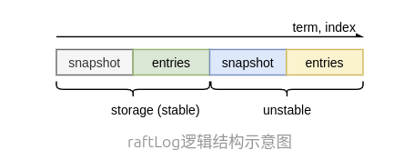

# 1. raft log的设计
为了进入日志复制流程，我们首先需要来看看`raft log`的设计。
我们可以看看下面这幅图。

`raftlog` 日志存储主要分为两部分，stable 和 unstable。二则都包含snapshot和entries。
`unstable`存储是etcd/raft实现的，而storage则需要使用者自己实现。etcd/raft将数据通过Ready结构体穿至应用层，应用层再保存至稳定存储。而读取则是调用`storage`相关的接口。

接下来我们来讲讲 **Stroage** ，**unstable**, **raftLog**
## 1.1 Stroage
`Storage`接口定义了etcd/raft中需要的读取稳定存储中日志、快照、状态等方法。
```go
// Storage is an interface that may be implemented by the application
// to retrieve log entries from storage.
//
// If any Storage method returns an error, the raft instance will
// become inoperable and refuse to participate in elections; the
// application is responsible for cleanup and recovery in this case.
type Storage interface {
	// TODO(tbg): split this into two interfaces, LogStorage and StateStorage.

	// InitialState returns the saved HardState and ConfState information.
	InitialState() (pb.HardState, pb.ConfState, error)
	// Entries returns a slice of log entries in the range [lo,hi).
	// MaxSize limits the total size of the log entries returned, but
	// Entries returns at least one entry if any.
	Entries(lo, hi, maxSize uint64) ([]pb.Entry, error)
	// Term returns the term of entry i, which must be in the range
	// [FirstIndex()-1, LastIndex()]. The term of the entry before
	// FirstIndex is retained for matching purposes even though the
	// rest of that entry may not be available.
	Term(i uint64) (uint64, error)
	// LastIndex returns the index of the last entry in the log.
	LastIndex() (uint64, error)
	// FirstIndex returns the index of the first log entry that is
	// possibly available via Entries (older entries have been incorporated
	// into the latest Snapshot; if storage only contains the dummy entry the
	// first log entry is not available).
	FirstIndex() (uint64, error)
	// Snapshot returns the most recent snapshot.
	// If snapshot is temporarily unavailable, it should return ErrSnapshotTemporarilyUnavailable,
	// so raft state machine could know that Storage needs some time to prepare
	// snapshot and call Snapshot later.
	Snapshot() (pb.Snapshot, error)
}
```
因为etcd/raft 出现了很多firstindex 和 lastIndex，我们在这里对常出现的index进行一个总结。

| 索引名             | 描述                                                 |
| --------------- | -------------------------------------------------- |
| committed index | 在该节点所知数量达到quorum的节点保存到了稳定存储中的日志里，index最高的日志的index。 |
| applied index   | 在该节点的应用程序已应用到其状态机的日志里，index最高的日志的index。            |
| firstIndex      | 在该节点的日志中，最新的快照之后的第一条日志的index。                      |
| lastIndex       | 在该节点的日志中，最后一条日志的index。                             |
从这里我们也可以知道Storage的LastIndex，FirstIndex方法不是raft 日志操作对应的两个index。

接下来我们可以来看看raft自带的Storage实现`MemoryStorage`。
```GO
// MemoryStorage implements the Storage interface backed by an
// in-memory array.
type MemoryStorage struct {
	// Protects access to all fields. Most methods of MemoryStorage are
	// run on the raft goroutine, but Append() is run on an application
	// goroutine.
	sync.Mutex

	hardState pb.HardState
	snapshot  pb.Snapshot
	// ents[i] has raft log position i+snapshot.Metadata.Index
	ents []pb.Entry
}
```
需要了解的是这里的ents的设计。`ents[0]`存的是一个dummy entry，其保存了快照的最后一条日志对应的term和index。`MemoryStorage`中`ents`字段可以直观表示为下图的结构:
![[memoryStorage的设计.png]]
前面已经提到过Storage的FirstIndex和LastIndex并不是raftlog的对应index。

## 1.2 unstable的设计与实现
```go
// unstable.entries[i] has raft log position i+unstable.offset.
// Note that unstable.offset may be less than the highest log
// position in storage; this means that the next write to storage
// might need to truncate the log before persisting unstable.entries.
type unstable struct {
	// the incoming unstable snapshot, if any.
	snapshot *pb.Snapshot
	// all entries that have not yet been written to storage.
	entries []pb.Entry
	offset  uint64

	logger Logger
}
```
`unstable`结构体中的`offset`字段记录了unstable的日志起点，该起点可能比`Storage`中index最高的日志条目旧，也就是说`Storage`和`unstable`中的日志可能有部分重叠，因此在处理二者之间的日志时，有一些裁剪日志的操作。其他变量的意义就相对比较清晰了。然后我们可以看看unstable的方法。

| 方法                                   | 描述                                                                                                |
| ------------------------------------ | ------------------------------------------------------------------------------------------------- |
| `maybeFirstIndex() (uint64, bool)`   | 获取相对整个`raftLog`的first index，当`unstable`无法得知该值时，第二个返回值返回`false`。                                   |
| `maybeLastIndex() (uint64, bool)`    | 获取相对整个`raftLog`的_last index_，当`unstable`无法得知该值时，第二个返回值返回`false`。                                  |
| `maybeTerm(i uint64) (uint64, bool)` | 获取给定index的日志条目的term，当`unstable`无法得知该值时，第二个返回值返回`false`                                            |
| `stableTo(i, t uint64)`              | 通知`unstable`当前index为`i`、term为`t`及其之前的日志已经被保存到了稳定存储中，可以裁剪掉`unstable`中的这段日志了。裁剪后会根据空间利用率适当地对空间进行优化。 |
| `stableSnapTo(i uint64)`             | 通知`unstable`当前index在`i`及其之前的快照已经保存到了稳定存储中，如果`unstable`中保存了该快照，那么可以释放该快照了。                         |
| `restore(s pb.Snapshot)`             | 根据快照恢复`unstable`的状态（设置`unstbale`中的`offset`、`snapshot`，并将`entries`置空）。                             |
| `truncateAndAppend(ents []pb.Entry)` | 对给定的日志切片进行裁剪，并将其加入到`unstable`保存的日志中。                                                              |
| `slice(lo uint64, hi uint64)`        | 返回给定范围内的日志切片。首先会通过`mustCheckOutOfBounds(lo, hi uint64)`方法检查是否越界，如果越界会因此panic。                     |
这里我们也先讲讲first index和 last index。这里的两个方法就是为了获得raft log的first inde和last index。
当`unstable`无法得知整个`raftLog`的first index或last index时，这两个方法的第二个返回值会被置为`false`。这种设计与`raftLog`的实现有关，在`raftLog`的`firstIndex`和`lastIndex`方法中，首先会调用`unstable`的`maybeFirstIndex`方法或`maybeLastIndex`方法，如果查询的索引不在`unstable`中时，其会继续询问`Storage`。`unstable`中`maybeFirstIndex`方法与`maybeLastIndex`方法的实现如下。
```go
// maybeFirstIndex returns the index of the first possible entry in entries
// if it has a snapshot.
func (u *unstable) maybeFirstIndex() (uint64, bool) {
	if u.snapshot != nil {
		return u.snapshot.Metadata.Index + 1, true
	}
	return 0, false
}

// maybeLastIndex returns the last index if it has at least one
// unstable entry or snapshot.
func (u *unstable) maybeLastIndex() (uint64, bool) {
	if l := len(u.entries); l != 0 {
		return u.offset + uint64(l) - 1, true
	}
	if u.snapshot != nil {
		return u.snapshot.Metadata.Index, true
	}
	return 0, false
}
```
获取Firstindex时候，如果 `unstable`存在镜像就可以确raft log的 first index位置。而获取last index时，只有unstable中同时不含有日志和快照才行。

接下来我们可以来看看 `truncateAndAppend`方法。如果剩余日志条目小于用来保存日志的切片容量的一半时，将剩余的日志拷贝到容量恰好为剩余日志长度的新切片中，并释放对原切片的引用。需要注意的是，这里不能直接释放原切片的空间或在原切片上进行修改，因为程序的其它部分可能还持有对原切片的引用。
```go
func (u *unstable) shrinkEntriesArray() {
	// We replace the array if we're using less than half of the space in
	// it. This number is fairly arbitrary, chosen as an attempt to balance
	// memory usage vs number of allocations. It could probably be improved
	// with some focused tuning.
	const lenMultiple = 2
	if len(u.entries) == 0 {
		u.entries = nil
	} else if len(u.entries)*lenMultiple < cap(u.entries) {
		newEntries := make([]pb.Entry, len(u.entries))
		copy(newEntries, u.entries)
		u.entries = newEntries
	}
}
```

## 1.3 raftLog的实现
```go
type raftLog struct {
	// storage contains all stable entries since the last snapshot.
	storage Storage

	// unstable contains all unstable entries and snapshot.
	// they will be saved into storage.
	unstable unstable

	// committed is the highest log position that is known to be in
	// stable storage on a quorum of nodes.
	committed uint64
	// applied is the highest log position that the application has
	// been instructed to apply to its state machine.
	// Invariant: applied <= committed
	applied uint64

	logger Logger

	// maxNextEntsSize is the maximum number aggregate byte size of the messages
	// returned from calls to nextEnts.
	maxNextEntsSize uint64
}
```
首先来看看firstindex 和 lastindex。
```go
func (l *raftLog) firstIndex() uint64 {
	if i, ok := l.unstable.maybeFirstIndex(); ok {
		return i
	}
	index, err := l.storage.FirstIndex()
	if err != nil {
		panic(err) // TODO(bdarnell)
	}
	return index
}

func (l *raftLog) lastIndex() uint64 {
	if i, ok := l.unstable.maybeLastIndex(); ok {
		return i
	}
	i, err := l.storage.LastIndex()
	if err != nil {
		panic(err) // TODO(bdarnell)
	}
	return i
}
```
获取的方法都是先从 `unstable` 中获取，如果没有从 `storage`  中获取。
接下来我们看看 `raftLog` 的部分方法。 

| 方法                                                                                | 描述                                             |
| --------------------------------------------------------------------------------- | ---------------------------------------------- |
| `newLogWithSize(storage Storage, logger Logger, maxNextEntsSize uint64) *raftLog` | 返回一个raftLog                                    |
| `maybeAppend(index, logTerm, committed uint64, ents ...pb.Entry)`                 | 尝试追加新日志，并更新_committed_索引（详见下文分析）。              |
| `append(ents ...pb.Entry) uint64`                                                 | 直接追加新日志                                        |
| `commitTo(tocommit uint64)`                                                       | 更新 `committed index`                           |
| `findConflict(ents []pb.Entry) uint64`                                            | 找到冲突位置，否则放回0                                   |
| `slice(lo, hi, maxSize uint64) ([]pb.Entry, error)`                               | 返回index从`lo`到`hi`的最多`maxSize`条日志，该方法会检查参数是否合法。 |

newLogWithSize方法的代码如下：
```go
func newLogWithSize(storage Storage, logger Logger, maxNextEntsSize uint64) *raftLog {  
    if storage == nil {  
       log.Panic("storage must not be nil")  
    }  
    log := &raftLog{  
       storage:         storage,  
       logger:          logger,  
       maxNextEntsSize: maxNextEntsSize,  
    }  
    firstIndex, err := storage.FirstIndex()  
    if err != nil {  
       panic(err) // TODO(bdarnell)  
    }  
    lastIndex, err := storage.LastIndex()  
    if err != nil {  
       panic(err) // TODO(bdarnell)  
    }  
    log.unstable.offset = lastIndex + 1  
    log.unstable.logger = logger  
    // Initialize our committed and applied pointers to the time of the last compaction.  
    log.committed = firstIndex - 1  
    log.applied = firstIndex - 1  
  
    return log  
}
```
其主要是将`unstable.offset`设为`lastIndex` + 1，`commited`和`applied`设为`first index` - 1。

maybeAppend 和 append可以放到一起看，二者都是写入日志的方法。区别在于`append`不会检查给定的日志切片是否与已有日志有冲突，因此leader向`raftLog`中追加日志时会调用该函数；而`maybeAppend`会检查是否有冲突并找到冲突位置，并试图通过覆盖本地日志的方式解决冲突。但是，二者都会检查给定的日志起点是否在`committed`索引位置之前，如果在其之前，这违背了Raft算法的**Log Matching**性质，因此会引起panic。
```go
/ maybeAppend returns (0, false) if the entries cannot be appended. Otherwise,
// it returns (last index of new entries, true).
func (l *raftLog) maybeAppend(index, logTerm, committed uint64, ents ...pb.Entry) (lastnewi uint64, ok bool) {
	if l.matchTerm(index, logTerm) {
		lastnewi = index + uint64(len(ents))
		ci := l.findConflict(ents)
		switch {
		case ci == 0:
		case ci <= l.committed:
			l.logger.Panicf("entry %d conflict with committed entry [committed(%d)]", ci, l.committed)
		default:
			offset := index + 1
			l.append(ents[ci-offset:]...)
		}
		l.commitTo(min(committed, lastnewi))
		return lastnewi, true
	}
	return 0, false
}

func (l *raftLog) append(ents ...pb.Entry) uint64 {
	if len(ents) == 0 {
		return l.lastIndex()
	}
	if after := ents[0].Index - 1; after < l.committed {
		l.logger.Panicf("after(%d) is out of range [committed(%d)]", after, l.committed)
	}
	l.unstable.truncateAndAppend(ents)
	return l.lastIndex()
}
```
`unstable.truncateAndAppend`在前面已经讲过了，append的逻辑就比较清晰了。我们主要看看`maybeAppend`。
首先，`maybeAppend`方法会检查这批日志的前一个条目的index和这批日志的term与`raftLog`对应条目的index与term是否匹配，如果不匹配则返回(0, false)。如果匹配无误，其会调用`findConflict`方法寻找待追加的日志与已有日志的第一个冲突条目的index或第一条新日志的index。在进一步分析之前，我们可以先来看看`findConflict`。
```go
func (l *raftLog) findConflict(ents []pb.Entry) uint64 {
	for _, ne := range ents {
		if !l.matchTerm(ne.Index, ne.Term) {
			if ne.Index <= l.lastIndex() {
				l.logger.Infof("found conflict at index %d [existing term: %d, conflicting term: %d]",
					ne.Index, l.zeroTermOnErrCompacted(l.term(ne.Index)), ne.Term)
			}
			return ne.Index
		}
	}
	return 0
}
```
`findConflict`返回的情况可以分为3种：
1. 如果给定的日志与已有的日志的index和term冲突，其会返回第一条冲突的日志条目的index。
2. 如果没有冲突，且给定的日志的所有条目均已在已有日志中，返回0.
3. 如果没有冲突，且给定的日志中包含已有日志中没有的新日志，返回第一条新日志的index。
`maybeAppend`会根据`findConflict`的返回值确定接下来的处理方式：
1. 如果返回0，说明既没有冲突又没有新日志，直接进行下一步处理。
2. 如果返回值小于当前的`committed`索引，说明`committed`前的日志发生了冲突，这违背了Raft算法保证的**Log Matching**性质，因此会引起panic。
3. 如果返回值大于`committed`，既可能是冲突发生在`committed`之后，也可能是有新日志。但二者的处理方式都是相同的，即从将从冲突处或新日志处开始的日志覆盖或追加到当前日志中即可。

追加或者覆盖完日志后，将会进入到commitTo方法。commitTo方法是更新`Committed index`的。更新直接看append的日志的最大值是否可以更新。commitTo方法相对简单，就不做过多分析了。

`raftLog`的`slice`方法是会返回指定的日志片段，该方法会检查给定的范围是否可以访问。
```go
// slice returns a slice of log entries from lo through hi-1, inclusive.
func (l *raftLog) slice(lo, hi, maxSize uint64) ([]pb.Entry, error) {
	err := l.mustCheckOutOfBounds(lo, hi)
	if err != nil {
		return nil, err
	}
	if lo == hi {
		return nil, nil
	}
	var ents []pb.Entry
	if lo < l.unstable.offset {
		storedEnts, err := l.storage.Entries(lo, min(hi, l.unstable.offset), maxSize)
		if err == ErrCompacted {
			return nil, err
		} else if err == ErrUnavailable {
			l.logger.Panicf("entries[%d:%d) is unavailable from storage", lo, min(hi, l.unstable.offset))
		} else if err != nil {
			panic(err) // TODO(bdarnell)
		}

		// check if ents has reached the size limitation
		if uint64(len(storedEnts)) < min(hi, l.unstable.offset)-lo {
			return storedEnts, nil
		}

		ents = storedEnts
	}
	if hi > l.unstable.offset {
		unstable := l.unstable.slice(max(lo, l.unstable.offset), hi)
		if len(ents) > 0 {
			combined := make([]pb.Entry, len(ents)+len(unstable))
			n := copy(combined, ents)
			copy(combined[n:], unstable)
			ents = combined
		} else {
			ents = unstable
		}
	}
	return limitSize(ents, maxSize), nil
}
```
在获取`raftLog`中的日志切片时，该方法首先会通过`mustCheckOutOfBounds`方法检查给定的范围是否越界。
```go
// l.firstIndex <= lo <= hi <= l.firstIndex + len(l.entries)
func (l *raftLog) mustCheckOutOfBounds(lo, hi uint64) error {
	if lo > hi {
		l.logger.Panicf("invalid slice %d > %d", lo, hi)
	}
	fi := l.firstIndex()
	if lo < fi {
		return ErrCompacted
	}

	length := l.lastIndex() + 1 - fi
	if hi > fi+length {
		l.logger.Panicf("slice[%d,%d) out of bound [%d,%d]", lo, hi, fi, l.lastIndex())
	}
	return nil
}
```
当获取到范是OK的之后。当`slice`确保给定范围没有越界后，如果这段范围跨了stable和unstable两部分，那么该方法会分别从`Storage`获取$[lo, unstable.offset)$, 从`unstable`获取$[unstable.offset,hi)$, 否则直接从其中一部分获取完整的切片。在返回切片前，`silce`还会按照`maxSize`参数限制返回的切片长度。

# 2.复制进度的追踪
这个主要是对 `nextInext`[] 和 `matchIndex`[]的追踪，当然etcd/raft肯定是做了一些优化并记录了一些额外信息的。
## 2.1 Progress结构体
```go
// Progress represents a follower’s progress in the view of the leader. Leader
// maintains progresses of all followers, and sends entries to the follower
// based on its progress.
//
// NB(tbg): Progress is basically a state machine whose transitions are mostly
// strewn around `*raft.raft`. Additionally, some fields are only used when in a
// certain State. All of this isn't ideal.
type Progress struct {
	Match, Next uint64
	// State defines how the leader should interact with the follower.
	//
	// When in StateProbe, leader sends at most one replication message
	// per heartbeat interval. It also probes actual progress of the follower.
	//
	// When in StateReplicate, leader optimistically increases next
	// to the latest entry sent after sending replication message. This is
	// an optimized state for fast replicating log entries to the follower.
	//
	// When in StateSnapshot, leader should have sent out snapshot
	// before and stops sending any replication message.
	State StateType

	// PendingSnapshot is used in StateSnapshot.
	// If there is a pending snapshot, the pendingSnapshot will be set to the
	// index of the snapshot. If pendingSnapshot is set, the replication process of
	// this Progress will be paused. raft will not resend snapshot until the pending one
	// is reported to be failed.
	PendingSnapshot uint64

	// RecentActive is true if the progress is recently active. Receiving any messages
	// from the corresponding follower indicates the progress is active.
	// RecentActive can be reset to false after an election timeout.
	//
	// TODO(tbg): the leader should always have this set to true.
	RecentActive bool

	// ProbeSent is used while this follower is in StateProbe. When ProbeSent is
	// true, raft should pause sending replication message to this peer until
	// ProbeSent is reset. See ProbeAcked() and IsPaused().
	ProbeSent bool

	// Inflights is a sliding window for the inflight messages.
	// Each inflight message contains one or more log entries.
	// The max number of entries per message is defined in raft config as MaxSizePerMsg.
	// Thus inflight effectively limits both the number of inflight messages
	// and the bandwidth each Progress can use.
	// When inflights is Full, no more message should be sent.
	// When a leader sends out a message, the index of the last
	// entry should be added to inflights. The index MUST be added
	// into inflights in order.
	// When a leader receives a reply, the previous inflights should
	// be freed by calling inflights.FreeLE with the index of the last
	// received entry.
	Inflights *Inflights

	// IsLearner is true if this progress is tracked for a learner.
	IsLearner bool
}
```
`Progress`中有两个重要的索引：`match`与`next`。`match`表示leader所知的该follower的日志中匹配的日志条目的最高index，如果leader不知道该follower的日志状态时，`match`为0；`next`表示leader接下来要给该follower发送的日志的第一个条目的index。。根据Raft算法论文，`next`是可能因异常回退的，而`match`是单调递增的。`next`小于`match`的节点会被认为是落后的节点。
`Progress`的一些常用的方法如下表所示：

| 方法                                 | 描述                                                                                                                               |
| ---------------------------------- | -------------------------------------------------------------------------------------------------------------------------------- |
| `ResetState(state StateType)`      | 重置状态为目标状态，该方法会清空所有状态记录的数据。该方法由`BecomeXXX`方法调用。                                                                                   |
| `BecomeProbe()`                    | 将follower转为Probe状态。                                                                                                              |
| `BecomeReplicate()`                | 将follower转为Replicate状态。                                                                                                          |
| `BecomeSnapshot(snapshoti uint64)` | 将follower转为Snapshot状态，并指定需要为其发送的快照的index。                                                                                        |
| `MaybeUpdate(n uint64) bool`       | 用于更新follower的进度（_match index_），如果传入的进度比当前进度旧，则不会更新进度并返回false，该方法还会根据传入的进度更新next index。leader会在收到来自follower的`MsgAppResp`消息时调用该方法。 |
|                                    |                                                                                                                                  |

## 2.2 Progress字段的一些说明
为了更加清晰地处理leader为follower复制日志的各种情况，etcd/raft将leader向follower复制日志的行为分成三种，记录在`Progress`的`State`字段中：
1. `StateProbe`：当leader刚刚当选时，或当follower拒绝了leader复制的日志时，该follower的进度状态会变为`StateProbe`类型。在该状态下，leader每次心跳期间仅为follower发送一条`MsgApp`消息，且leader会根据follower发送的相应的`MsgAppResp`消息调整该follower的进度。
2. `StateReplicate`：该状态下的follower处于稳定状态，leader会优化为其复制日志的速度，每次可能发送多条`MsgApp`消息（受`Progress`的流控限制，后文会详细介绍）。
3. `StateSnapshot`：当follower所需的日志已被压缩无法访问时，leader会将该follower的进度置为`StateSnapshot`状态，并向该follower发送快照。leader不会为处于`StateSnapshot`状态的follower发送任何的`MsgApp`消息，直到其成功收到快照。

`Progress`中的`RecentActive`字段用来标识该follower最近是否是“活跃”的。该字段除了用于**Check Quorum**外，在日志复制时，leader不会将不活跃的follower转为`StateSnapshot`状态或发送快照。

`Progress`的`Inflights`字段是对日志复制操作进行流控的字段。虽然`Config`的`MaxSizePerMsg`字段限制了每条`MsgApp`消息的字节数，但是在`StateReplicate`状态下优化日志复制时，每次可能会发送多条`MsgApp`消息。因此，`Config`中又加入了`MaxInflightMsgs`字段来限制每次发送的`MsgApp`消息数。`Inflights`实现了`MaxInflightMsgs`字段配置的流控。

`Inflights`结构体实现了一一个环形队列，其中记录了每条`MsgApp`的`Index`字段的值。其实现比较简单不在过多赘述。

## 2.3 follower状态转换
在进一步分析etcd/raft的日志复制实现时，需要先简单了解`BecomeXXX`在进行状态转换时的做的操作及更新进度。
```go
// BecomeProbe transitions into StateProbe. Next is reset to Match+1 or,
// optionally and if larger, the index of the pending snapshot.
func (pr *Progress) BecomeProbe() {
	// If the original state is StateSnapshot, progress knows that
	// the pending snapshot has been sent to this peer successfully, then
	// probes from pendingSnapshot + 1.
	if pr.State == StateSnapshot {
		pendingSnapshot := pr.PendingSnapshot
		pr.ResetState(StateProbe)
		pr.Next = max(pr.Match+1, pendingSnapshot+1)
	} else {
		pr.ResetState(StateProbe)
		pr.Next = pr.Match + 1
	}
}
```
`BecomeProbe`分为两种情况，一种是从`StateSnapshot`进入`StateProbe`状态，当leader得知follower成功应用了快照后，需要调用`Node`的`ReportSnapshot`方法，该方法会调用`BecomeProbe`将该follower的进度状态转为`StateProbe`。此时，可以将next index置为该快照的index的下一条。在一般情况下，则从match index处开始检测。
```go
// BecomeReplicate transitions into StateReplicate, resetting Next to Match+1.
func (pr *Progress) BecomeReplicate() {
	pr.ResetState(StateReplicate)
	pr.Next = pr.Match + 1
}

// BecomeSnapshot moves the Progress to StateSnapshot with the specified pending
// snapshot index.
func (pr *Progress) BecomeSnapshot(snapshoti uint64) {
	pr.ResetState(StateSnapshot)
	pr.PendingSnapshot = snapshoti
}
```
`BecomeReplicate`和`BecomeSnapshot`逻辑都很简单，在重置状态后，二者分别设置了相应的_next index_和正在发送的快照的index。

## 2.4 match index 和 next index 回退 的分析。
```go
// MaybeUpdate is called when an MsgAppResp arrives from the follower, with the
// index acked by it. The method returns false if the given n index comes from
// an outdated message. Otherwise it updates the progress and returns true.
func (pr *Progress) MaybeUpdate(n uint64) bool {
	var updated bool
	if pr.Match < n {
		pr.Match = n
		updated = true
		pr.ProbeAcked()
	}
	pr.Next = max(pr.Next, n+1)
	return updated
}
```
`MaybeUpdate`会根据传入的index更新`Match`和`Next`到更高的值，如果`Match`更新，则会返回true，同时立刻对`StateProbe`状态的follower进行确认，否则返回false。其调用者会根据返回值判断该follower是否跟上了复制进度。

```go
// MaybeDecrTo adjusts the Progress to the receipt of a MsgApp rejection. The
// arguments are the index the follower rejected to append to its log, and its
// last index.
//
// Rejections can happen spuriously as messages are sent out of order or
// duplicated. In such cases, the rejection pertains to an index that the
// Progress already knows were previously acknowledged, and false is returned
// without changing the Progress.
//
// If the rejection is genuine, Next is lowered sensibly, and the Progress is
// cleared for sending log entries.
func (pr *Progress) MaybeDecrTo(rejected, last uint64) bool {
	if pr.State == StateReplicate {
		// The rejection must be stale if the progress has matched and "rejected"
		// is smaller than "match".
		if rejected <= pr.Match {
			return false
		}
		// Directly decrease next to match + 1.
		//
		// TODO(tbg): why not use last if it's larger?
		pr.Next = pr.Match + 1
		return true
	}

	// The rejection must be stale if "rejected" does not match next - 1. This
	// is because non-replicating followers are probed one entry at a time.
	if pr.Next-1 != rejected {
		return false
	}

	pr.Next = max(min(rejected, last+1), 1)
	pr.ProbeSent = false
	return true
}
```
`MaybeDecrTo`的参数有follower拒绝的`MsgApp`请求的index（rejected），和该follower最后一条日志的索引（last），其中，`rejected`参数是用来判断该消息是否是过期的消息的，其判断逻辑如下：
1. 如果follower的状态为`StateReplicate`，`Next`应该是跟上`Match`的进度的，那么如果`rejected`不大于`Match`，那么该消息过期。
2. 在其它状态下，`Next`可能没有跟上`Match`的进度，因此不能通过`Match`判断。由于其它状态下至多只会为其发送一条日志复制请求，因此只要`rejected`不等于`Next-1`，该消息就是过期的。
接着就可以回退next indexl了。`Next`的回退有两种方案：
1.  回退一条日志。即新的`Next`为上一条`Next-1`，这里的`Next-1`即为发送`MsgApp`时用于日志匹配的`Index`字段的值，也是`rejected`的值。
2. 快速回退，回退到该follower的最后一条日志。即新的`Next`为该follower最后一条日志的后一条日志的index，即`last+1`。


# 3. 日志复制的流程
## 3.1 节点启动的日志处理
在节点启动时，日志的last index就是稳定存储`Storage`的last index。follower和candidate不需要对日志进行额外的处理，而leader需要获取每个follower（和learner）的进度，并以当前term提交一条空日志条目，以提交之前term的日志。同样，当新leader当选时，也需要做同样的操作。如下是`becomeLeader`与`reset`中与日志复制有关的源码：
```go
func (r *raft) becomeLeader() {
	// ... ...
	r.reset(r.Term)
	// ... ...

	// Followers enter replicate mode when they've been successfully probed
	// (perhaps after having received a snapshot as a result). The leader is
	// trivially in this state. Note that r.reset() has initialized this
	// progress with the last index already.
	r.prs.Progress[r.id].BecomeReplicate()

	// ... ...

	emptyEnt := pb.Entry{Data: nil}
	if !r.appendEntry(emptyEnt) {
		// This won't happen because we just called reset() above.
		r.logger.Panic("empty entry was dropped")
	}
	// As a special case, don't count the initial empty entry towards the
	// uncommitted log quote. This is because we want to preserve the
	// behavior of allowing one entry larger than quote if the current
	// usage is zero.
	r.reduceUncommittedSize([]pb.Entry{emptyEnt})
	r.logger.Infof("%x became leader at term %d", r.id, r.Term)
}

func (r *raft) reset(term uint64) {
	// ... ...
	r.prs.ResetVotes()
	r.prs.Visit(func(id uint64, pr *tracker.Progress) {
		*pr = tracker.Progress{
			Match:     0,
			Next:      r.raftLog.lastIndex() + 1,
			Inflights: tracker.NewInflights(r.prs.MaxInflight),
			IsLearner: pr.IsLearner,
		}
		if id == r.id {
			pr.Match = r.raftLog.lastIndex()
		}
	})
	// ... ...
}
```
在`becomeLeader`调用`reset`方法时，会初始化所有节点的 next index 为leader日志的  last index + 1。因为leader刚当选时不知道除了自己之外的节点的复制进度，将除自己外的所有节点的 match index 置为0，而将自己的  match index 置为自己的 last index 。
随后，leader会在当前term为自己的日志追加一条空日志条目，以提交之前term的日志。
在将控日志条目加入到日志后，有一行`r.reduceUncommittedSize([]pb.Entry{emptyEnt})`代码。想了解这样代码的作用，需要先了解etcd/raft中避免新日志过多无法处理速度跟不上的机制。
在`Config`中，可以看到如下的一条配置：
```go
	// MaxUncommittedEntriesSize limits the aggregate byte size of the
	// uncommitted entries that may be appended to a leader's log. Once this
	// limit is exceeded, proposals will begin to return ErrProposalDropped
	// errors. Note: 0 for no limit.
	MaxUncommittedEntriesSize uint64
```
该配置用于限制leader日志中未提交日志的最大字节数，如果超过该值则丢弃新提议，以避免新日志过多处理速度跟不上。当该值为0时，表示不设限制。etcd/raft是以如下方式实现该约束的：
- 在leader调用`appendEntry`方法向日志追加新条目时，`appendEntry`方法会调用`increaseUncommittedSize(ents []pb.Entry) bool`方法，该方法会根据配置与`raft`结构体中的`uncommittedSize`字段判断追加后会不会超过`MaxUncommittedEntriesSize`的限制，如果超过了该限制，会返回false，`appendEntry`方法会拒绝这些提议，如果没有超过限制，则仅增大`uncommittedSize`字段字段并返回true。需要注意的是，当`uncommittedSize`字段为0时不会拒绝提议，以保证leader不会因单条较大的`MsgProp`消息阻塞；同样该方法也不会拒绝空日志条目，因为其常用于新当选的leader提交之前的term的日志或离开_joint configuration_。
-  在etcd/raft的使用者调用`Node`的`Advance`方法时，会调用`reduceUncommittedSize(ents []pb.Entry)`方法，以释放流控容量。`increaseUncommittedSize`和`reduceUncommittedSize`的源码如下：
```go
func (r *raft) increaseUncommittedSize(ents []pb.Entry) bool {
	var s uint64
	for _, e := range ents {
		s += uint64(PayloadSize(e))
	}

	if r.uncommittedSize > 0 && s > 0 && r.uncommittedSize+s > r.maxUncommittedSize {
		return false
	}
	r.uncommittedSize += s
	return true
}

func (r *raft) reduceUncommittedSize(ents []pb.Entry) {
	if r.uncommittedSize == 0 {
		return
	}

	var s uint64
	for _, e := range ents {
		s += uint64(PayloadSize(e))
	}
	if s > r.uncommittedSize {
		r.uncommittedSize = 0
	} else {
		r.uncommittedSize -= s
	}
}
```
而在`becomeLeader`中，写入空日志条目后，空日志条目也可能会占用一部分容量（与计算日志大小的方式有关，之前etcd/raft中直接通过protobuf生成的`Size()`方法计算，其会受其它字段影响，详见[pull#10199](https://github.com/etcd-io/etcd/pull/10199)）。因此，为了不将空日志条目的大小记在其中，其调用了`reduceUncommittedSize`方法。

在`becomeLeader`执行完后，就会进入正常的处理逻辑。此时，所有follower的进度状态为默认状态`StateProbe`，以便leader获取follower的进度。

## 3.2 leader中的日志提议
日志的提议是通过`MsgProp`消息实现的。candidate或pre candidate直接丢弃`MsgProp`消息，follower会将`MsgProp`消息转发给leader，只有leader会对`MsgProp`消息做真正的处理：
```go
// stepCandidate
// ... ...
case pb.MsgProp:
	r.logger.Infof("%x no leader at term %d; dropping proposal", r.id, r.Term)
	return ErrProposalDropped

// stepFollower :
// ... ...
case pb.MsgProp:
	if r.lead == None {
		r.logger.Infof("%x no leader at term %d; dropping proposal", r.id, r.Term)
		return ErrProposalDropped
	} else if r.disableProposalForwarding {
		r.logger.Infof("%x not forwarding to leader %x at term %d; dropping proposal", r.id, r.lead, r.Term)
		return ErrProposalDropped
	}
	m.To = r.lead
	r.send(m)

// stepLeader :
// ... ...
case pb.MsgProp:
	if len(m.Entries) == 0 {
		r.logger.Panicf("%x stepped empty MsgProp", r.id)
	}
	if r.prs.Progress[r.id] == nil {
		// If we are not currently a member of the range (i.e. this node
		// was removed from the configuration while serving as leader),
		// drop any new proposals.
		return ErrProposalDropped
	}
	if r.leadTransferee != None {
		r.logger.Debugf("%x [term %d] transfer leadership to %x is in progress; dropping proposal", r.id, r.Term, r.leadTransferee)
		return ErrProposalDropped
	}

	// Process ConfChange Msg
	//... ...

	if !r.appendEntry(m.Entries...) {
		return ErrProposalDropped
	}
	r.bcastAppend()
	return nil
```
在leader将`MsgProp`中的提议追加到本地日志之前，还需要做一些判断与处理：

1. 首先leader会检查自己的`Progress`结构是否还存在，以判断自己是否已经被`ConfChange`操作移出了集群，如果该leader被移出了集群，则不会处理该提议。
2. 接着，leader还会判断当前是否在进行 `leader transfer`，如果该leader正在将领导权转移给其它节点，那么同样不会处理该提议。
3. 如果提议中包含`ConfChange`消息，会做特殊处理，在后文介绍`ConfChange`时会分析这部分逻辑，这里暂时不做介绍。
4. 如果在追加提议中的日志后会超过`MaxUncommittedSize`的限制，则不会追加该提议。

如果leader成功地将这些日志追加到了本地日志中，leade会调用`bcastAppend`方法，为所有follower（和learner）广播日志追加消息。


## 3.3 leader为follower复制日志
leader通过`bcastAppend`方法为follower（和learner）复制日志，该方法及其相关方法源码如下：
```go
// bcastAppend sends RPC, with entries to all peers that are not up-to-date
// according to the progress recorded in r.prs.
func (r *raft) bcastAppend() {
	r.prs.Visit(func(id uint64, _ *tracker.Progress) {
		if id == r.id {
			return
		}
		r.sendAppend(id)
	})
}

// sendAppend sends an append RPC with new entries (if any) and the
// current commit index to the given peer.
func (r *raft) sendAppend(to uint64) {
	r.maybeSendAppend(to, true)
}

// maybeSendAppend sends an append RPC with new entries to the given peer,
// if necessary. Returns true if a message was sent. The sendIfEmpty
// argument controls whether messages with no entries will be sent
// ("empty" messages are useful to convey updated Commit indexes, but
// are undesirable when we're sending multiple messages in a batch).
func (r *raft) maybeSendAppend(to uint64, sendIfEmpty bool) bool {
	pr := r.prs.Progress[to]
	if pr.IsPaused() {
		return false
	}
	m := pb.Message{}
	m.To = to

	term, errt := r.raftLog.term(pr.Next - 1)
	ents, erre := r.raftLog.entries(pr.Next, r.maxMsgSize)
	if len(ents) == 0 && !sendIfEmpty {
		return false
	}

	if errt != nil || erre != nil { // send snapshot if we failed to get term or entries

		// ... ... #1

	} else {

		// ... ... #2

	}
	r.send(m)
	return true
}
```
leader在调用`bcastAppend`方法时，会向所有其它节点广播`MsgApp`或`MsgSnap`消息，且即使是空消息也会广播。这里需要关注的是`maybeSendAppend`的实现，该函数是向一个节点发送`MsgApp`或`MsgSnap`消息的方法。
该方法的大致流程是：
1. 首先通过`Prgoress`的`IsPaused`方法检查该节点进度，如果该节点进度阻塞了，那么不会向其发送消息。
2. 获取用于日志匹配的日志条目（index为`next index - 1`的日志）的term。
3. 获取该节点的 next index 之后的日志。
4. 如果日志长度为0且不需要发送空日志，那么直接返回。
5. 如果步骤2、3中任一步骤产生了错误，说明用于日志匹配的条目已被压缩，该节点落后了太多，因此需要为其发送`MsgSnap`消息；否则，发送`MsgApp`消息。
6. 调用`send`方法，填充需要发送的消息中缺失的字段（如`Term`、`From`，具体逻辑见`send`方法的源码，这里不再赘述），并将消息放入该节点的信箱。由于etcd/raft不负责通信模块，因此这里不会真正发送，而是通过`Ready`结构体将需要发送的消息交给etcd/raft的使用者处理。
接下来是看看MsgApp和MsgSnap的生产方式。
```go
m.Type = pb.MsgApp
m.Index = pr.Next - 1
m.LogTerm = term
m.Entries = ents
m.Commit = r.raftLog.committed
if n := len(m.Entries); n != 0 {
	switch pr.State {
	// optimistically increase the next when in StateReplicate
	case tracker.StateReplicate:
		last := m.Entries[n-1].Index
		pr.OptimisticUpdate(last)
		pr.Inflights.Add(last)
	case tracker.StateProbe:
		pr.ProbeSent = true
	default:
		r.logger.Panicf("%x is sending append in unhandled state %s", r.id, pr.State)
	}
}
```
这段逻辑配置了`MsgApp`消息的相关字段。`Index`和`LogTerm`字段是用于日志匹配的日志（即发送的日志的上一条日志）的index与term（用于日志匹配的term字段为`LogTerm`，消息的`Term`字段为该节点当前的term，部分消息需要自己指定，部分消息由`send`方法填充）。`Entries`字段保存了需要复制的日志条目。`Commit`字段为leader提交的最后一条日志的索引。
如果该消息携带的日志非空，该方法还会更新该follower的进度状态：
- 如果节点处于`StateReplicate`状态，此时通过流水线的方式优化日志复制速度，直接更新其`Next`索引，并通过`Inflights`进行流控
-  如果节点处于`StateProbe`状态，此时将`ProbeSent`置为true，阻塞后续的消息，直到收到确认。
在分析了`MsgApp`消息的生成方式后，接下来分析`MsgSnap`消息的生成：

```go
// ... ... #1
if !pr.RecentActive {
	r.logger.Debugf("ignore sending snapshot to %x since it is not recently active", to)
	return false
}

m.Type = pb.MsgSnap
snapshot, err := r.raftLog.snapshot()
if err != nil {
	if err == ErrSnapshotTemporarilyUnavailable {
		r.logger.Debugf("%x failed to send snapshot to %x because snapshot is temporarily unavailable", r.id, to)
		return false
	}
	panic(err) // TODO(bdarnell)
}
if IsEmptySnap(snapshot) {
	panic("need non-empty snapshot")
}
m.Snapshot = snapshot
sindex, sterm := snapshot.Metadata.Index, snapshot.Metadata.Term
r.logger.Debugf("%x [firstindex: %d, commit: %d] sent snapshot[index: %d, term: %d] to %x [%s]",
	r.id, r.raftLog.firstIndex(), r.raftLog.committed, sindex, sterm, to, pr)
pr.BecomeSnapshot(sindex)
r.logger.Debugf("%x paused sending replication messages to %x [%s]", r.id, to, pr)

```

在准备快照之前，这段逻辑线判断了该follower节点最近是否是活跃的，如果不活跃则不会为其发送快照。
在生成快照并检测快照无误后，需要通过`BecomeSnapshot`方法将该follower的状态转为`StateSnapshot`，以阻塞该节点后续的`MsgApp`消息。
在follower转为`StateSnapshot`后，只有两种跳出`StateSnapshot`的方法：
1. follower节点应用快照后会发送`MsgAppResp`消息，该消息会报告当前follower的 last index 。如果follower应用了快照后 last index 就追赶上了其 match index，那么leader会直接将follower的状态转移到`StateRelicate`状态，为其继续复制日志。
2. leader节点的使用者还需要主动调用`Node`的`ReportSnapshot`方法告知leader节点快照的应用状态，leader会将该follower的状态转移到`StateProbe`状态（与方法1重复的消息会被忽略）。

方法1的逻辑会在后文介绍leader对`MsgAppResp`消息的处理时介绍，这里仅介绍方法2。

在`Ready`的`Entries`字段的注释中可以看到，如果需要发送的日志中包含`MsgSnap`消息，那么当前节点（一定是leader节点）必须在目标节点应用完该消息后调用`Node`的`ReportSnapshot`方法上报快照状态。该方法在`rawnode`中的实现方式如下：

```go
// ReportSnapshot reports the status of the sent snapshot.
func (rn *RawNode) ReportSnapshot(id uint64, status SnapshotStatus) {
	rej := status == SnapshotFailure

	_ = rn.raft.Step(pb.Message{Type: pb.MsgSnapStatus, From: id, Reject: rej})
}

```
`ReportSnapshot`方法会将一条`MsgSnapStatus`消息应用给leader状态机。如果快照应用失败，该消息的`Reject`字段会被置为true。只有leader需要处理`MsgSnapStatus`消息，其处理方式如下：
```go
// stepLeader
// ... ...
case pb.MsgSnapStatus:
if pr.State != tracker.StateSnapshot {
	return nil
}
// TODO(tbg): this code is very similar to the snapshot handling in
// MsgAppResp above. In fact, the code there is more correct than the
// code here and should likely be updated to match (or even better, the
// logic pulled into a newly created Progress state machine handler).
if !m.Reject {
	pr.BecomeProbe()
	r.logger.Debugf("%x snapshot succeeded, resumed sending replication messages to %x [%s]", r.id, m.From, pr)
} else {
	// NB: the order here matters or we'll be probing erroneously from
	// the snapshot index, but the snapshot never applied.
	pr.PendingSnapshot = 0
	pr.BecomeProbe()
	r.logger.Debugf("%x snapshot failed, resumed sending replication messages to %x [%s]", r.id, m.From, pr)
}
// If snapshot finish, wait for the MsgAppResp from the remote node before sending
// out the next MsgApp.
// If snapshot failure, wait for a heartbeat interval before next try
pr.ProbeSent = true
```
从这段逻辑中可以看到，无论快照应用是否成功，leader都会将该follower的进度状态转为`StateProbe`状态。不同之处仅在于在调用`BecomeProbe`方法之前是否将`PendingSnapshot`的值置为0。读者可以回顾`becomeProbe`的实现（详见3.3节），在没有将其置为0时，下一次检测日志匹配时会从该follower的 match index + 1 和该快照的 index+1 二者中较大者开始检测；而将其置为0后，只会从该follower的 match index + 1 开始检测。


## 4.4 follower 处理来自 leader 的日志
follower处理来自leader的日志复制消息时，同样分为对`MsgApp`和对`MsgSnap`的处理，`handleAppendEntries`方法用来处理`MsgApp`消息、`handleSnapshot`用来处理`MsgSnap`消息。在处理这两种消息时，都会使用`MsgAppResp`方法对其进行相应。
```go
func (r *raft) handleAppendEntries(m pb.Message) {  
    // 1.首先判断index是否小于commited index， 小于说明是过期日志，不做处理  
    // 2. 接着调用maybeAppend看是否可以append日志  
    // 3. 如果拓展失败说明发送了冲突  
    // 4.寻找冲突是找到最大 (index, term)，具体的解释可以看注释  
  
    if m.Index < r.raftLog.committed {  
       r.send(pb.Message{To: m.From, Type: pb.MsgAppResp, Index: r.raftLog.committed})  
       return  
    }  
  
    if mlastIndex, ok := r.raftLog.maybeAppend(m.Index, m.LogTerm, m.Commit, m.Entries...); ok {  
       r.send(pb.Message{To: m.From, Type: pb.MsgAppResp, Index: mlastIndex})  
    } else {  
       r.logger.Debugf("%x [logterm: %d, index: %d] rejected MsgApp [logterm: %d, index: %d] from %x",  
          r.id, r.raftLog.zeroTermOnErrCompacted(r.raftLog.term(m.Index)), m.Index, m.LogTerm, m.Index, m.From)  
  
		// Return a hint to the leader about the maximum index and term that the  
	    // two logs could be divergent at. Do this by searching through the       
	    // follower's log for the maximum (index, term) pair with a term <= the
	    // MsgApp's LogTerm and an index <= the MsgApp's Index. This can help       
	    // skip all indexes in the follower's uncommitted tail with terms       
	    // greater than the MsgApp's LogTerm.       
	    //       
	    // See the other caller for findConflictByTerm (in stepLeader) for a much       
	    // more detailed explanation of this mechanism.       
       intIndex := min(m.Index, r.raftLog.lastIndex())  
       hintIndex = r.raftLog.findConflictByTerm(hintIndex, m.LogTerm)  
       hintTerm, err := r.raftLog.term(hintIndex)  
       if err != nil {  
          panic(fmt.Sprintf("term(%d) must be valid, but got %v", hintIndex, err))  
       }  
       r.send(pb.Message{  
          To:         m.From,  
          Type:       pb.MsgAppResp,  
          Index:      m.Index,  
          Reject:     true,  
          RejectHint: hintIndex,  
          LogTerm:    hintTerm,  
       })  
    }  
}
```
follower对`MsgApp`消息的处理可分为如下情况：
1. 首先判断index是否小于commited index， 小于说明是过期日志，不做处理 。并将消息的`Index`字段置为`committed`的值，以让leader快速更新该follower的 next index 。
2. 接着调用maybeAppend看是否可以append日志  
3. 如果拓展失败说明发送了冲突  
4. 寻找冲突是找到最大 (index, term)
这个的寻找值得讲一讲。
1. 首先先设定hintIndex为leader 传过来的index和自己lastindex的最小值。
2. 调用findConflictByTerm找到index <= hintIndex, term <= LogTerm的最大index位置，否则直接返回第一条日志。
3. 然后再根据这个位置获取hintTerm。就如注释中所说，这能帮助leader跳过follower中大部分未commit的 尾巴。

而`handleSnapshot`的处理方式如下：
```go
func (r *raft) handleSnapshot(m pb.Message) {
	sindex, sterm := m.Snapshot.Metadata.Index, m.Snapshot.Metadata.Term
	if r.restore(m.Snapshot) {
		r.logger.Infof("%x [commit: %d] restored snapshot [index: %d, term: %d]",
			r.id, r.raftLog.committed, sindex, sterm)
		r.send(pb.Message{To: m.From, Type: pb.MsgAppResp, Index: r.raftLog.lastIndex()})
	} else {
		r.logger.Infof("%x [commit: %d] ignored snapshot [index: %d, term: %d]",
			r.id, r.raftLog.committed, sindex, sterm)
		r.send(pb.Message{To: m.From, Type: pb.MsgAppResp, Index: r.raftLog.committed})
	}
}
```
处理`MsgSnap`消息时，`handleSnapshot`方法会调用`restore`方法尝试应用快照。如果快照应用功能成功，则返回一条`MsgAppResp`消息，该消息的`Index`字段为本地最后一条日志的index；而如果快照没有被应用，那么返回的`MsgAppResp`消息的`Index`字段会被置为本地的`committed`索引。
可以看出，对`MsgSnap`消息的处理，重点在`restore`方法的实现。
```go
// restore recovers the state machine from a snapshot. It restores the log and the
// configuration of state machine. If this method returns false, the snapshot was
// ignored, either because it was obsolete or because of an error.
func (r *raft) restore(s pb.Snapshot) bool {
	if s.Metadata.Index <= r.raftLog.committed {
		return false
	}
	
	// ... ...

	// Now go ahead and actually restore.

	if r.raftLog.matchTerm(s.Metadata.Index, s.Metadata.Term) {
		r.logger.Infof("%x [commit: %d, lastindex: %d, lastterm: %d] fast-forwarded commit to snapshot [index: %d, term: %d]",
			r.id, r.raftLog.committed, r.raftLog.lastIndex(), r.raftLog.lastTerm(), s.Metadata.Index, s.Metadata.Term)
		r.raftLog.commitTo(s.Metadata.Index)
		return false
	}

	r.raftLog.restore(s)

	// ... ...

	r.logger.Infof("%x [commit: %d, lastindex: %d, lastterm: %d] restored snapshot [index: %d, term: %d]",
		r.id, r.raftLog.committed, r.raftLog.lastIndex(), r.raftLog.lastTerm(), s.Metadata.Index, s.Metadata.Term)
	return true
```
`restore`方法中有一些对`ConfChange`的处理，这部分会在本系列后续的文章中介绍，这里暂时略过。除此之外，`restore`中还有一些防止不应发生的情况的“Defense in depth”代码，这里也不做介绍，感兴趣的读者可以自行结合注释了解。
`restore`对快照做了如下处理：

1. 如果快照的index没超过本地的`committed`索引，这说明快照过旧，因此不做处理直接返回false。
2. 将快照的index和term与本地日志匹配，如果成功匹配，说明本地日志已经包含了快照覆盖的日志，因此不要应用该快照。同时，因为快照覆盖的日志都应是已被提交的日志，这也说明了本地的`committed`索引落后了，因此调用`raftLog`的`commitTo`方法，让本地`committed`索引快速前进到该快照的index，然后直接返回false。
3. 如果到这里方法仍没返回，则可以将快照应用到本地。调用`raftLog`的`restore`方法，并返回true。

无论是处理`MsgApp`消息还是处理`MsgSnap`消息，返回的消息都是`MsgAppResp`。下一节中将分析leader对`MsgAppResp`消息的处理方式。

## 4.5 leader 处理来自 follower的 MsgAppResp
`stepLeader`方法在处理`MsgAppResp`消息时，会根据该消息和发送该消息的follower的状态来进行不同的处理：
```go
// stepLeader
// ... ...
case pb.MsgAppResp:
pr.RecentActive = true

if m.Reject {
	r.logger.Debugf("%x received MsgAppResp(MsgApp was rejected, lastindex: %d) from %x for index %d", r.id, m.RejectHint, m.From, m.Index)
	nextProbeIdx := m.RejectHint
	if m.LogTerm > 0 {
		nextProbeIdx = r.raftLog.findConflictByTerm(m.RejectHint, m.LogTerm)  
	}
	if pr.MaybeDecrTo(m.Index, nextProbeIdx) {	
		r.logger.Debugf("%x decreased progress of %x to [%s]", r.id, m.From, pr)
		if pr.State == tracker.StateReplicate {
			pr.BecomeProbe()
		}
		r.sendAppend(m.From)
	}
} else {
	oldPaused := pr.IsPaused()
	if pr.MaybeUpdate(m.Index) {
		switch {
		case pr.State == tracker.StateProbe:
			pr.BecomeReplicate()
		case pr.State == tracker.StateSnapshot && pr.Match >= pr.PendingSnapshot:
			// TODO(tbg): we should also enter this branch if a snapshot is
			// received that is below pr.PendingSnapshot but which makes it
			// possible to use the log again.
			r.logger.Debugf("%x recovered from needing snapshot, resumed sending replication messages to %x [%s]", r.id, m.From, pr)
			// Transition back to replicating state via probing state
			// (which takes the snapshot into account). If we didn't
			// move to replicating state, that would only happen with
			// the next round of appends (but there may not be a next
			// round for a while, exposing an inconsistent RaftStatus).
			pr.BecomeProbe()
			pr.BecomeReplicate()
		case pr.State == tracker.StateReplicate:
			pr.Inflights.FreeLE(m.Index)
		}

		if r.maybeCommit() {
			r.bcastAppend()
		} else if oldPaused {
			// If we were paused before, this node may be missing the
			// latest commit index, so send it.
			r.sendAppend(m.From)
		}
		// We've updated flow control information above, which may
		// allow us to send multiple (size-limited) in-flight messages
		// at once (such as when transitioning from probe to
		// replicate, or when freeTo() covers multiple messages). If
		// we have more entries to send, send as many messages as we
		// can (without sending empty messages for the commit index)
		for r.maybeSendAppend(m.From, false) {
		}
		
		// ... ...

	}
}
```
这段逻辑首先处理了`MsgAppResp`的`Reject`字段为true的情况，这只会在follower处理`MsgApp`消息时发现日志条目不匹配时发生。
1. 首先，调用了`MaybeDecrTo`方法回退其`Next`索引，其中利用RejectHint和logterm。
2. 如果回退失败，说明这是一条过期的消息，不做处理；
3. 如果回退成功，且该节点为`StateReplicate`状态，则调用`BecomeProbe`使其转为`StateProbe`状态来查找最后一条匹配日志的位置。
4. 回退成功时，还会再次为该节点调用`sendAppend`方法，以为其发送`MsgApp`消息。

在处理`MsgAppResp`的`Reject`为false的消息时，其会调用`MaybeUpdate`方法来判断该消息的`Index`字段是否跟上了该follower的_match index_，并在需要时更新其_next index_。如果该消息没有跟上_match index_，那么不会对该消息做其它处理。其原因有三：
1. 这条消息是过期的消息，不需要处理。
2. 这条消息可能是follower应用快照发来的响应，且此时该follower仍未跟上其 match index（可能是follower重启恢复后导致的）。此处后续处理逻辑即为在[4.3节](https://blog.mrcroxx.com/posts/code-reading/etcdraft-made-simple/4-log/#43-leader%e4%b8%bafollower%e5%a4%8d%e5%88%b6%e6%97%a5%e5%bf%97)中提到的跳出`StateSnapshot`的第1中情况；如果这里因没跟上 match index 而没有跳出`StateSnapshot`状态，也会在etcd/raft模块使用者主动调用`ReportSnapshot`方法时跳出该状态。因此不会阻塞。
3. 这条消息可能是StateProbe状态的follower发来的确认相应，但此时该follower仍未跟上其_match index_（可能是follower重启恢复后导致的）。因在一次心跳周期内，leader仅应向处于`StateProbe`状态的follower发送1条`MsgApp`消息，因此其释放应在心跳相关的逻辑中，该逻辑会在后文分析。因此也不会阻塞。

在分析完为什么这里仅处理跟上_match index_的`MsgAppResp`消息后，接下来其处理方式。
首先，该方法会根据发送该消息的follower的状态进行处理：
1. 如果该follower处于`StateProbe`状态且现在跟上了进度，则将其转为`StateReplica`状态。
2. 如果该follower处于`StateSnapshot`状态且现在跟上了进度，且从该follower发送该消息后到leader处理这条消息时，leader没有为其发送新快照（通过比较`Match`与`PendingSnapshot`判断），则将其转为`StateReplica`状态。
3. 如果该follower处于`StateReplicate`状态，那么释放`Inflights`中该消息的`Index`字段值之前的所有消息。因为收到的`MsgAppResp`可能是乱序的，因此需要释放之前的所有消息（过期消息不会被处理）。

接下来，该方法调用了`maybeCommit`方法，该方法会根据所有节点的进度更新leader的_commit index_，在_commit index_有更新时返回true，否则返回false（该方法中有与成员变更相关的逻辑，这里暂时不对其进行分析，而是将其留给后续的文章，这里只需要知道其功能即可）。如果_commit index_有更新，那么调用`bcastAppend`方法广播新的`committed`索引。如果_commit index_没有更新，还需要进一步判断该follower之前是否是阻塞的，如果是那么为该follower发送一条日志复制消息以更新其`committed`索引，因为在该节点阻塞时可能错过了`committed`索引的更新消息。

接着，通过for循环继续为该节点发送新的日志复制消息。因为日志复制部分有流控逻辑，因此这里的循环不会成为死循环。这样做可以尽可能多地为节点复制日志，以提高日志复制效率。

## 4.6 心跳消息中日志复制相关操作
除了`MsgApp`、`MsgSnap`、`MsgAppResp`消息外，心跳消息`MsgHeartbeat`即其相应的相应消息`MsgHeartbeatResp`中也有一些与日志复制相关的逻辑（如`StateProbe`状态下释放阻塞状态的逻辑）。虽然这部分逻辑不多但同样重要，本节分析这部分逻辑。
```go
// stepLeader
// ... ...
case pb.MsgBeat:
	r.bcastHeartbeat()

// ... ...

// sendHeartbeat sends a heartbeat RPC to the given peer.
func (r *raft) sendHeartbeat(to uint64, ctx []byte) {
	// Attach the commit as min(to.matched, r.committed).
	// When the leader sends out heartbeat message,
	// the receiver(follower) might not be matched with the leader
	// or it might not have all the committed entries.
	// The leader MUST NOT forward the follower's commit to
	// an unmatched index.
	commit := min(r.prs.Progress[to].Match, r.raftLog.committed)
	m := pb.Message{
		To:      to,
		Type:    pb.MsgHeartbeat,
		Commit:  commit,
		Context: ctx,
	}

	r.send(m)
}
```
在`tickHeartbeat`方法中，每次心跳会将一条`MsgBeat`应用到状态机。该消息会触发`bcastHeartbeat`方法，为其它节点广播心跳消息。`bcastHeartbeat`方法中有一些与实现线性一致性读相关的逻辑，这里将其留给本系列的后续文章。这里只需要看该方法最后调用的`sendHeartbeat`方法，方法生成的`MsgHeartbeat`消息中的`Index`字段为leader的`committed`索引。而在follower处理`MsgHeartbeat`消息时，会根据该字段更新自己的`committed`索引，以避免空闲集群没有新提议无法更新follower的`committed`状态的问题。
```go
func (r *raft) handleHeartbeat(m pb.Message) {
	r.raftLog.commitTo(m.Commit)
	r.send(pb.Message{To: m.From, Type: pb.MsgHeartbeatResp, Context: m.Context})
}
```

随后，follower会向leader发送`MsgHeartbeatResp`消息作为响应。leader在处理该消息时，主要做的也是线性一致性读相关的处理，但也有部分与日志复制相关的逻辑：
```go
case pb.MsgHeartbeatResp:
		pr.RecentActive = true
		pr.ProbeSent = false

		// free one slot for the full inflights window to allow progress.
		if pr.State == tracker.StateReplicate && pr.Inflights.Full() {
			pr.Inflights.FreeFirstOne()
		}
		if pr.Match < r.raftLog.lastIndex() {
			r.sendAppend(m.From)
		}
		
		// ... ...
```

在leader收到新条例响应时，会重置`ProbeSent`为false，以在下一个心跳周期继续为处于`StateProbe`的follower复制日志。

同时，如果该follower处于`StateReplicate`状态且其用于流控的`Inflights`已满，leader会为其释放一个`Inflights`的槽位，以保证在每个心跳周期处于`StateReplicate`状态的follower都至少能收到一条`MsgApp`消息。

最后，如果该节点的_match index_小于leader当前最后一条日志，则为其调用`sendAppend`方法来复制新日志。


# 一些疑问
- match index 什么时候更新？
这里我们主要看follower什么时候更新，leader再初始化的时候match 就是 last index， 而follower 的match index都是0。
leader再收到MsgAppRsp的时候就会尝试更新Match Index而后再进行其他处理。
```go
func (pr *Progress) MaybeUpdate(n uint64) bool {  
    var updated bool  
    if pr.Match < n {  
       pr.Match = n  
       updated = true  
       pr.ProbeAcked()  
    }  
    pr.Next = max(pr.Next, n+1)  
    return updated  
}
```